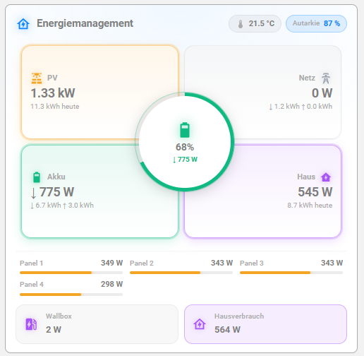

# Power Flow Tiles Card

[](https://my.home-assistant.io/redirect/hacs_repository/?owner=GB-1972&repository=ha-power-flow-tiles-card&category=plugin)

Moderne, Apple/Tesla-inspirierte Home-Assistant-Karte für PV-/Speicher-/Netz-/Haus-Stromflüsse — ohne Schaltplan-Look. Vier Eck-Tiles, zentraler Akku-Hub mit SOC-Donut, animierte Flow-Pfade dazwischen. Vanilla JS, keine Build-Pipeline.



## Status

v0.2.0 — Prototyp mit visuellem Editor.

## Installation (manuell)

1. `power-flow-tiles-card.js` nach `config/www/` kopieren.
2. **Einstellungen → Dashboards → Ressourcen** → hinzufügen:
   - URL: `/local/power-flow-tiles-card.js?v=0.2.0`
   - Typ: **JavaScript-Modul**
3. Browser-Cache leeren (Shift-Reload).

## Visueller Editor

Beim Hinzufügen der Karte im Dashboard ist der **visuelle Editor** der Default:
- Top-Felder: Titel, Icon
- Aufklappbare Sektionen: Umgebung, Solar, Akku, Netz, Haus, Autarkie, Erweitert
- **PV-Strings** und **Verbraucher** als dynamische Listen mit Add/Remove
- Farben werden als CSS-Farbtext eingegeben (z. B. `#f5a524`, `rgba(...)` oder HA-Theme-Variablen wie `var(--primary-color)`)
- Tiefere YAML-Eingriffe weiterhin über *„Code-Editor anzeigen"*

## Konfig-Beispiel (deine Setup)

```yaml
type: custom:power-flow-tiles-card
title: Energiemanagement
icon: mdi:home-lightning-bolt-outline

environment:
  temperature: sensor.menden_oesbern_temperature

solar:
  power: sensor.system_gb_homebase_sb_solarleistung
  energy_today: sensor.system_gb_homebase_taglicher_solarertrag
  color: "#f5a524"
  mppts:
    - name: "Links unten"
      power: sensor.gb_solarspeicher_solar_pv1
      max: 420
    - name: "Rechts oben"
      power: sensor.gb_solarspeicher_solar_pv2
      max: 420
    - name: "Links oben"
      power: sensor.gb_solarspeicher_solar_pv3
      max: 420
    - name: "Rechts unten"
      power: sensor.gb_solarspeicher_solar_pv4
      max: 420

battery:
  power: sensor.gb_solarspeicher_akkuleistung
  soc: sensor.system_gb_homebase_sb_ladestand
  capacity_kwh: 10.2
  invert_power: true
  charge_today: sensor.system_gb_homebase_tagliche_aufladung
  discharge_today: sensor.system_gb_homebase_tagliche_entladung
  color: "#10b981"
  color_discharge: "#3b82f6"

grid:
  power: sensor.hauptstrom_netzeinspeisung
  invert: false
  import_today: sensor.system_gb_homebase_tagliche_netznutzung
  export_today: sensor.system_gb_homebase_tagliche_netzeinspeisung
  color_import: "#ef4444"
  color_export: "#fb923c"

home:
  power: sensor.gb_solarspeicher_ac_hausabgabe
  energy_today: sensor.system_gb_homebase_taglicher_hausverbrauch
  color: "#a855f7"
  loads:
    - name: Wallbox
      icon: mdi:ev-station
      power: sensor.wallbox_total_active_power
    - name: Hausverbrauch
      icon: mdi:home-lightning-bolt-outline
      power: sensor.gb_solarspeicher_hausbedarf

autarky:
  mode: energy        # oder 'power' für Live-Berechnung
```

## Vorzeichen-Konventionen

| Größe         | Default (config-Default) | Bedeutung positiv | Schalter zum Drehen |
| ------------- | ------------------------ | ----------------- | ------------------- |
| `battery.power` | `invert_power: false` ⇒ pos = Entladen | pos = Entladen, neg = Laden | `invert_power: true` dreht: pos = Laden |
| `grid.power`    | `invert: false` ⇒ pos = Bezug | pos = Bezug, neg = Einspeisung | `invert: true` dreht: pos = Einspeisung |

Wenn die Animation falsch herum läuft (z. B. „Akku entlädt, obwohl er lädt") → den entsprechenden Schalter umlegen.

## Optionen

### Top-Level

| Option           | Typ    | Default                              | Beschreibung                                                |
| ---------------- | ------ | ------------------------------------ | ----------------------------------------------------------- |
| `title`          | string | `''`                                 | Header-Titel.                                              |
| `icon`           | string | `mdi:home-lightning-bolt-outline`    | Header-Icon.                                                |
| `decimals_power` | number | `2`                                  | Nachkommastellen für kW-Werte.                              |
| `decimals_energy`| number | `1`                                  | Nachkommastellen für kWh-Werte.                             |
| `flow_threshold` | number | `5`                                  | Watt-Schwelle, ab der ein Fluss als aktiv gilt (Animation). |

### `environment`

| Option        | Typ    | Beschreibung                                |
| ------------- | ------ | ------------------------------------------- |
| `temperature` | entity | Außentemperatur (°C) für den Header-Chip. Optional. |

### `solar`

| Option         | Typ    | Beschreibung                                          |
| -------------- | ------ | ----------------------------------------------------- |
| `power`        | entity | Gesamt-PV-Leistung in W.                              |
| `energy_today` | entity | Tagesertrag in kWh (Sub-Text im PV-Tile).             |
| `color`        | css    | Akzentfarbe.                                          |
| `mppts`        | list   | Liste der einzelnen Strings, beliebig viele Einträge. |

Pro `mppts`-Eintrag:

| Option   | Typ    | Beschreibung                              |
| -------- | ------ | ----------------------------------------- |
| `name`   | string | Anzeigename.                              |
| `power`  | entity | Leistung dieses Strings in W.             |
| `max`    | number | Maximalleistung (für die Füllstand-Bar).  |

### `battery`

| Option            | Typ    | Beschreibung                                                |
| ----------------- | ------ | ----------------------------------------------------------- |
| `power`           | entity | Aktuelle Akku-Leistung in W.                                |
| `soc`             | entity | Ladestand in % (für Hub-Donut + Hub-Mitte).                 |
| `capacity_kwh`    | number | Brutto-Kapazität in kWh.                                    |
| `invert_power`    | bool   | `true` = positiv heißt Laden. Default `false`.              |
| `charge_today`    | entity | Tägliche Aufladung (Sub-Text Akku-Tile).                    |
| `discharge_today` | entity | Tägliche Entladung (Sub-Text Akku-Tile).                    |
| `color`           | css    | Farbe Laden + Default-Donut.                                |
| `color_discharge` | css    | Farbe Entladen.                                             |

### `grid`

| Option          | Typ    | Beschreibung                                       |
| --------------- | ------ | -------------------------------------------------- |
| `power`         | entity | Netz-Leistung in W.                                |
| `invert`        | bool   | `true` = positiv heißt Einspeisung. Default `false`. |
| `import_today`  | entity | Täglicher Bezug in kWh.                            |
| `export_today`  | entity | Tägliche Einspeisung in kWh.                       |
| `color_import`  | css    | Farbe bei Bezug.                                   |
| `color_export`  | css    | Farbe bei Einspeisung.                             |

### `home`

| Option         | Typ    | Beschreibung                                                |
| -------------- | ------ | ----------------------------------------------------------- |
| `power`        | entity | Gesamt-Hausverbrauch in W.                                  |
| `energy_today` | entity | Tagesverbrauch in kWh.                                      |
| `color`        | css    | Akzentfarbe.                                                |
| `loads`        | list   | Zusatz-Tiles unten (Wallbox, etc.), beliebig viele Einträge.|

Pro `loads`-Eintrag: `name`, `icon`, `power`.

### `autarky`

| Option | Typ    | Werte             | Beschreibung                                                                                                                         |
| ------ | ------ | ----------------- | ------------------------------------------------------------------------------------------------------------------------------------ |
| `mode` | string | `power`/`energy` | `power`: Live-Berechnung aus `home.power` und `grid.power`. `energy`: kumuliert aus `home.energy_today` und `grid.import_today`. |

## Klicks

Jedes Tile öffnet bei Klick den HA-„Weitere Infos"-Dialog der jeweils naheliegendsten Entity (PV-Power, Grid-Power, Battery-SOC, Home-Power). Zusatz-Loads ebenso.

## Roadmap

- [x] Visueller Editor
- [ ] Optionaler zweiter Akku
- [ ] Optionale Inverter-Status-Zeile
- [ ] Mehr Layout-Varianten (vertical stack, wide)
- [ ] HACS-Eintrag

## Lizenz

MIT (geplant — bei Veröffentlichung).
