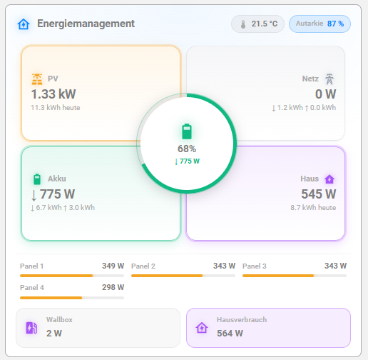

# Power Flow Tiles Card

[](https://my.home-assistant.io/redirect/hacs_repository/?owner=GB-1972&repository=ha-power-flow-tiles-card&category=plugin)

Moderne, Apple/Tesla-inspirierte Home-Assistant-Karte für PV-/Speicher-/Netz-/Haus-Stromflüsse — ohne Schaltplan-Look. Vier Eck-Tiles, zentraler Akku-Hub mit SOC-Donut, animierte Flow-Pfade dazwischen. Vanilla JS, keine Build-Pipeline.



## Status

v0.5.15 — `solar.strings`-Spalte oben rechts gilt jetzt auf allen Bildschirmbreiten (der Mobile-Fallback ≤500px, der wieder auf die gestapelte Variante zurückfiel, ist entfernt — nur die Schriftgröße schrumpft dort noch etwas). (v0.5.14: Spalte oben rechts eingeführt, aber mit Mobile-Fallback der versehentlich immer griff; v0.5.13: alle Strings untereinander, aber unterhalb der PV-Leistung; v0.5.12: Umbruch statt Ellipsis; v0.5.9: dieselbe Tagesertrag-Idee auf Ebene der einzelnen MPPT-Strings.)

## Installation (manuell)

1. `power-flow-tiles-card.js` nach `config/www/` kopieren.
2. **Einstellungen → Dashboards → Ressourcen** → hinzufügen:
   - URL: `/local/power-flow-tiles-card.js?v=0.5.15`
   - Typ: **JavaScript-Modul**
3. Browser-Cache leeren (Shift-Reload).

## Visueller Editor

Beim Hinzufügen der Karte im Dashboard ist der **visuelle Editor** der Default:
- Top-Felder: Titel, Icon
- Aufklappbare Sektionen: Umgebung, Solar, Akku, Netz, Haus, Autarkie, Erweitert
- **PV-Strings** und **Verbraucher** als dynamische Listen mit Add/Remove
- Farben werden als CSS-Farbtext eingegeben (z. B. `#f5a524`, `rgba(...)` oder HA-Theme-Variablen wie `var(--primary-color)`)
- Tiefere YAML-Eingriffe weiterhin über *„Code-Editor anzeigen"*

## Konfig-Beispiel (deine Setup)

```yaml
type: custom:power-flow-tiles-card
title: Energiemanagement
icon: mdi:home-lightning-bolt-outline

environment:
  temperature: sensor.menden_oesbern_temperature

solar:
  power: sensor.system_gb_homebase_sb_solarleistung
  energy_today: sensor.system_gb_homebase_taglicher_solarertrag
  color: "#f5a524"
  mppts:
    - name: "Links unten"
      power: sensor.gb_solarspeicher_solar_pv1
      energy_today: sensor.gb_solarspeicher_solar_pv1_tagesertrag
      max: 420
    - name: "Rechts oben"
      power: sensor.gb_solarspeicher_solar_pv2
      energy_today: sensor.gb_solarspeicher_solar_pv2_tagesertrag
      max: 420
    - name: "Links oben"
      power: sensor.gb_solarspeicher_solar_pv3
      energy_today: sensor.gb_solarspeicher_solar_pv3_tagesertrag
      max: 420
    - name: "Rechts unten"
      power: sensor.gb_solarspeicher_solar_pv4
      energy_today: sensor.gb_solarspeicher_solar_pv4_tagesertrag
      max: 420
  strings:
    - name: "Anker"
      energy_today: sensor.system_gb_homebase_solar_ertrag_taglich
    - name: "SE"
      energy_today: sensor.garage_sunenergyxt_heutige_pv_erzeugung
    - name: "HM"
      energy_today: sensor.hoymiles_tagesertrag

battery:
  power: sensor.gb_solarspeicher_akkuleistung
  soc: sensor.system_gb_homebase_sb_ladestand
  capacity_kwh: 10.2
  invert_power: true
  charge_today: sensor.system_gb_homebase_tagliche_aufladung
  discharge_today: sensor.system_gb_homebase_tagliche_entladung
  color: "#10b981"
  color_discharge: "#3b82f6"

grid:
  power: sensor.hauptstrom_netzeinspeisung
  invert: false
  import_today: sensor.system_gb_homebase_tagliche_netznutzung
  export_today: sensor.system_gb_homebase_tagliche_netzeinspeisung
  solar_covered: sensor.pv_deckung
  color_import: "#ef4444"
  color_export: "#fb923c"

home:
  power: sensor.gb_solarspeicher_ac_hausabgabe
  energy_today: sensor.system_gb_homebase_taglicher_hausverbrauch
  color: "#a855f7"
  loads_columns: 3     # optional: feste Spaltenzahl statt automatischem Reflow
  loads:
    - name: Anker
      icon: mdi:home-lightning-bolt-outline
      pv: sensor.gb_solarspeicher_solarleistung        # aktiviert Detail-Modus
      to_house: sensor.gb_solarspeicher_ac_hausabgabe
      to_battery: sensor.gb_solarspeicher_aufladeleistung
    - name: SunEnergy
      icon: mdi:home-lightning-bolt-outline
      pv: sensor.sunenergyxt_pv_gesamteingangsleistung
      to_house: sensor.xt_local_op
      to_battery: sensor.xt_akku_leistung
    - name: Hoymiles
      icon: mdi:home-lightning-bolt-outline
      pv: sensor.gb_bkw_power
      to_house: sensor.gb_bkw_power                    # kein Speicher vorhanden
    - name: Wallbox
      icon: mdi:ev-station
      power: sensor.wallbox_total_active_power
      full_width: true   # eigene Zeile darunter statt in der Spaltenreihe

autarky:
  mode: energy        # oder 'power' für Live-Berechnung
```

## Vorzeichen-Konventionen

| Größe         | Default (config-Default) | Bedeutung positiv | Schalter zum Drehen |
| ------------- | ------------------------ | ----------------- | ------------------- |
| `battery.power` | `invert_power: false` ⇒ pos = Entladen | pos = Entladen, neg = Laden | `invert_power: true` dreht: pos = Laden |
| `grid.power`    | `invert: false` ⇒ pos = Bezug | pos = Bezug, neg = Einspeisung | `invert: true` dreht: pos = Einspeisung |

Wenn die Animation falsch herum läuft (z. B. „Akku entlädt, obwohl er lädt") → den entsprechenden Schalter umlegen.

## Optionen

### Top-Level

| Option           | Typ    | Default                              | Beschreibung                                                |
| ---------------- | ------ | ------------------------------------ | ----------------------------------------------------------- |
| `title`          | string | `''`                                 | Header-Titel.                                              |
| `icon`           | string | `mdi:home-lightning-bolt-outline`    | Header-Icon.                                                |
| `decimals_power` | number | `2`                                  | Nachkommastellen für kW-Werte.                              |
| `decimals_energy`| number | `1`                                  | Nachkommastellen für kWh-Werte.                             |
| `flow_threshold` | number | `5`                                  | Watt-Schwelle, ab der ein Fluss als aktiv gilt (Animation). |

### `environment`

| Option        | Typ    | Beschreibung                                |
| ------------- | ------ | ------------------------------------------- |
| `temperature` | entity | Außentemperatur (°C) für den Header-Chip. Optional. |

### `solar`

| Option         | Typ    | Default     | Beschreibung                                                                                              |
| -------------- | ------ | ----------- | --------------------------------------------------------------------------------------------------------- |
| `power`        | entity | –           | Gesamt-PV-Leistung in W.                                                                                  |
| `energy_today` | entity | –           | Tagesertrag in kWh (Sub-Text im PV-Tile).                                                                 |
| `color`        | css    | `#f5a524`   | Akzentfarbe.                                                                                              |
| `show_sun_arc` | bool   | `true`      | Eigene Sektion oben mit Lens-förmigem Bogen, Aufgangs-/Untergangszeit, Tag-/Nacht-Dauer, % des Tages und wandernder Sonne inkl. Power-Pill. `false` zum Ausblenden. |
| `sun_entity`   | entity | `sun.sun`   | Sonne-Entity (`domain: sun`) für `next_rising` / `next_setting`. Standard reicht für die meisten Setups. |
| `mppts`        | list   | `[]`        | Liste der einzelnen MPPT-Strings/Panels, beliebig viele Einträge.                                          |
| `strings`      | list   | `[]`        | Liste der Anlagen/Quellen (z. B. Anker/SunEnergy/Hoymiles) für die Tagesertrag-Aufschlüsselung direkt in der PV-Kachel. Nicht zu verwechseln mit `mppts` — siehe unten. |

Pro `mppts`-Eintrag (einzelner MPPT/Panel, unterhalb der Karte als eigene Zeile mit Füllstand-Bar):

| Option         | Typ    | Beschreibung                                                        |
| -------------- | ------ | -------------------------------------------------------------------- |
| `name`         | string | Anzeigename.                                                        |
| `power`        | entity | Leistung dieses Strings in W.                                       |
| `energy_today` | entity | Optional. Tages-Gesamtleistung (Ertrag) dieses Strings in kWh — kompakt neben dem Leistungswert, ändert die Kachelgröße nicht. |
| `max`          | number | Maximalleistung (für die Füllstand-Bar).                            |

Pro `strings`-Eintrag (Anlagen-Gesamtwert, eigene umbrechende Zeile unterhalb des normalen `solar.energy_today`-Sub-Texts in der PV-Kachel):

| Option         | Typ    | Beschreibung                                                        |
| -------------- | ------ | -------------------------------------------------------------------- |
| `name`         | string | Kurzer Anzeigename (z. B. „Anker", „SE", „HM").                      |
| `energy_today` | entity | Tagesertrag dieser Anlage in kWh.                                    |

Layout: Icon/Leistung/`X kWh heute` bleiben links wie gehabt, `strings` erscheint als separate Spalte rechtsbündig oben in der Kachel (`Anker 7.1 kWh` / `SE 7.3 kWh` / `HM 4.3 kWh`, jeweils eine eigene Zeile). Auf schmalen Bildschirmen (≤500px) fällt das automatisch zurück auf einen Block unterhalb der PV-Leistung. Die Schriftgröße der aktuellen PV-Leistung (großer Wert links) ändert sich nicht.

### `battery`

| Option            | Typ    | Beschreibung                                                |
| ----------------- | ------ | ----------------------------------------------------------- |
| `name`            | string | Optionaler Anzeigename, klein über dem Akku — im Tile (Single-Modus über dem Power-Wert, Split-Modus über der linken Spalte) **und** im Hub-Donut über der Mini-Zeile. Leer = keine Zeile. |
| `power`           | entity | Aktuelle Akku-Leistung in W.                                |
| `soc`             | entity | Ladestand in % (für Hub-Donut + Hub-Mitte).                 |
| `capacity_kwh`    | number | Brutto-Kapazität in kWh.                                    |
| `invert_power`    | bool   | `true` = positiv heißt Laden. Default `false`.              |
| `charge_today`    | entity | Tägliche Aufladung (Sub-Text Akku-Tile).                    |
| `discharge_today` | entity | Tägliche Entladung (Sub-Text Akku-Tile).                    |
| `color`           | css    | Farbe Laden + Default-Donut.                                |
| `color_discharge` | css    | Farbe Entladen.                                             |

### `battery2` (optional, zweiter Akku)

Wird **nur** gerendert, wenn `show_battery2: true` UND mindestens `battery2.power` oder `battery2.soc` gesetzt ist. Bei Single-Akku-Setups das `battery2`-Feld einfach weglassen — keine Änderung am bestehenden Look.

| Option             | Typ    | Default     | Beschreibung                                                              |
| ------------------ | ------ | ----------- | ------------------------------------------------------------------------- |
| `show_battery2`    | bool   | `false`     | Top-level Toggle. Schaltet Akku 2 ein/aus, ohne Sensor-Auswahl zu löschen. |
| `name`             | string | –           | Optionaler Anzeigename, klein über der rechten Tile-Spalte und im Hub-Donut über der unteren Mini-Zeile. Leer = keine Zeile. |
| `power`            | entity | –           | Wie bei Akku 1.                                                            |
| `soc`              | entity | –           | Wie bei Akku 1.                                                            |
| `capacity_kwh`     | number | –           | Wie bei Akku 1.                                                            |
| `invert_power`     | bool   | `false`     | Wie bei Akku 1.                                                            |
| `charge_today`     | entity | –           | Wie bei Akku 1.                                                            |
| `discharge_today`  | entity | –           | Wie bei Akku 1.                                                            |
| `color`            | css    | `#f59e0b`   | Farbe Laden — bewusst andersfarbig als Akku 1 (Amber), damit die Ringe optisch getrennt sind. |
| `color_discharge`  | css    | `#d946ef`   | Farbe Entladen — Fuchsia.                                                  |

**Visualisierung mit 2 Akkus:**
- Hub-Donut: außen Akku 1, innen Akku 2 (zwei konzentrische Ringe).
- Hub-Mitte: zwei gestapelte Mini-Zeilen — pro Akku Icon · SOC % · Power-Pfeil.
- Akku-Tile unten links: zwei Spalten (links Akku 1, rechts Akku 2).
- Flow-Linie zum Hub: eine Linie, Power = Summe beider Akkus, Richtung folgt Vorzeichen der Summe (Netto-Bilanz).

### `grid`

| Option          | Typ    | Beschreibung                                       |
| --------------- | ------ | -------------------------------------------------- |
| `power`         | entity | Netz-Leistung in W.                                |
| `invert`        | bool   | `true` = positiv heißt Einspeisung. Default `false`. |
| `import_today`  | entity | Täglicher Bezug in kWh.                            |
| `export_today`  | entity | Tägliche Einspeisung in kWh.                       |
| `solar_covered` | entity | Optional. Aktuelle Leistung (W), die gerade von lokaler PV/Speicher-Erzeugung gedeckt wird (nicht vom Netz). Wird als zusätzliche Zeile "☀ … W PV-gedeckt" im Netz-Tile angezeigt, in der Solar-Akzentfarbe. Leer/weggelassen = Zeile wird nicht angezeigt. |
| `color_import`  | css    | Farbe bei Bezug.                                   |
| `color_export`  | css    | Farbe bei Einspeisung.                             |

### `home`

| Option         | Typ    | Beschreibung                                                |
| -------------- | ------ | ----------------------------------------------------------- |
| `power`         | entity | Gesamt-Hausverbrauch in W.                                  |
| `energy_today`  | entity | Tagesverbrauch in kWh.                                      |
| `color`         | css    | Akzentfarbe.                                                |
| `loads_columns` | number | Optional. Feste Spaltenzahl für die `loads`-Kacheln (z. B. `3`). Ohne Angabe: automatisches Reflow je nach Breite (Default, wie bisher). |
| `loads`         | list   | Zusatz-Tiles unten (Wallbox, etc.), beliebig viele Einträge.|

Pro `loads`-Eintrag: `name`, `icon`, entweder `power` (einfache Anzeige, ein Wert) **oder** `pv` (aktiviert den Detail-Modus: PV-Leistung als farbiger Hauptwert nach Leistungsband — <200W grau, <500W rot, <1000W blau, <1500W orange, ≥1500W grün, dieselben Schwellen wie bei den MPPT-Strings) zusammen mit optional `to_house` (Zeile "→ Haus") und `to_battery` (Zeile "→ Speicher", negative Werte — z. B. Akku entlädt — werden als 0 dargestellt). Zusätzlich optional `full_width` (bool, Default `false`) — bei `true` bekommt diese Kachel eine eigene volle Zeile unterhalb der übrigen Loads, statt sich in die Spaltenreihe einzureihen.

### `autarky`

| Option | Typ    | Werte             | Beschreibung                                                                                                                         |
| ------ | ------ | ----------------- | ------------------------------------------------------------------------------------------------------------------------------------ |
| `mode` | string | `power`/`energy` | `power`: Live-Berechnung aus `home.power` und `grid.power`. `energy`: kumuliert aus `home.energy_today` und `grid.import_today`. |

## Klicks

Jedes Tile öffnet bei Klick den HA-„Weitere Infos"-Dialog der jeweils naheliegendsten Entity (PV-Power, Grid-Power, Battery-SOC, Home-Power). Zusatz-Loads ebenso.

## Roadmap

- [x] Visueller Editor
- [x] Optionaler zweiter Akku
- [ ] Optionale Inverter-Status-Zeile
- [ ] Mehr Layout-Varianten (vertical stack, wide)
- [ ] HACS-Eintrag

## Lizenz

MIT (geplant — bei Veröffentlichung).
